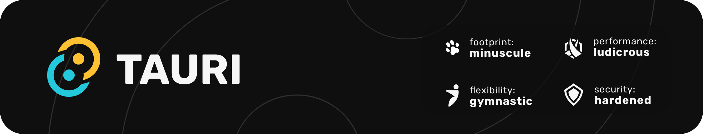

[](https://github.com/tauri-apps/tauri/tree/dev)
[](https://opencollective.com/tauri)
[](https://github.com/tauri-apps/tauri/actions/workflows/test-core.yml)
[](https://app.fossa.com/projects/git%2Bgithub.com%2Ftauri-apps%2Ftauri?ref=badge_shield)
[](https://discord.com/invite/tauri)
[](https://tauri.app)
[](https://good-labs.github.io/greater-good-affirmation)
[](https://opencollective.com/tauri)

## Introduction

Tauri is a framework for building tiny, blazingly fast binaries for all major desktop platforms. Developers can integrate any front-end framework that compiles to HTML, JS and CSS for building their user interface. The backend of the application is a rust-sourced binary with an API that the front-end can interact with.

The user interface in Tauri apps currently leverages [`tao`](https://docs.rs/tao) as a window handling library on macOS, Windows, Linux, Android and iOS. To render your application, Tauri uses [WRY](https://github.com/tauri-apps/wry), a library which provides a unified interface to the system webview, leveraging WKWebView on macOS & iOS, WebView2 on Windows, WebKitGTK on Linux and Android System WebView on Android.

To learn more about the details of how all of these pieces fit together, please consult this [ARCHITECTURE.md](https://github.com/tauri-apps/tauri/blob/dev/ARCHITECTURE.md) document.

## DX Serializer Performance Fork

This local fork adds opt-in DX serializer `.machine` caches for selected Tauri CLI/config hot paths. That is the important part: this was not a broad rewrite of Tauri. By threading the DX serializer crate into the right JSON/TOML/Cargo parsing boundaries, the fork turns repeated text parsing into validated binary cache reads while keeping source files authoritative.

The cache files are generated before timing, validated against the authoritative source files, and treated as disposable accelerators. Source JSON/TOML/Cargo inputs remain the source of truth.

Measured against the official Tauri `v2.11.2` release binary on the recorded fixtures, this fork is faster in the changed CLI surfaces:

| Measured surface | Official Tauri | DX serializer fork | Result |
| :--------------- | -------------: | -----------------: | -----: |
| `inspect wix-upgrade-code` | `155.504 ms` | `50.854 ms` | `3.06x` faster |
| `migrate-stable-v2-noop` | `94.448 ms` | `41.027 ms` | `2.30x` faster |

The internal current-fork parser-vs-`.machine` hot paths show larger wins where the serializer cache is the direct replacement for repeated JSON/Cargo parsing:

| Hot path | Recorded speedup |
| :------- | ---------------: |
| Package manifest and lock metadata | `17.470x` faster |
| Watch-folder discovery / Cargo metadata projection | `13.708x` faster |
| `cargo metadata --no-deps` cache read | `11.317x` faster |
| Package version resolution | `4.978x` faster |

These numbers are a real win for the cache-heavy CLI/config paths we changed. The shape of the win matters: a focused serializer-cache layer produced measurable speedups without changing Tauri's public product model or making generated `.machine` files authoritative. This is exactly the kind of performance work that compounds: small, source-compatible, and brutally measurable.

They are not a claim that every Tauri workflow is faster: app runtime, WebView startup, IPC, full `tauri dev`, build, bundle, installer, mobile/toolchain, and default-on release behavior need their own receipts before they can be claimed.

## Getting Started

If you are interested in making a tauri app, please visit the [documentation website](https://tauri.app).

The quickest way to get started is to install the [prerequisites](https://v2.tauri.app/start/prerequisites/) for your system and create a new project with [`create-tauri-app`](https://github.com/tauri-apps/create-tauri-app/#usage). For example with `npm`:

```sh
npm create tauri-app@latest
```

## Features

The list of Tauri's features includes, but is not limited to:

- Built-in app bundler to create app bundles in formats like `.app`, `.dmg`, `.deb`, `.rpm`, `.AppImage` and Windows installers like `.exe` (via NSIS) and `.msi` (via WiX).
- Built-in self updater (desktop only)
- System tray icons
- Native notifications
- Native WebView Protocol (tauri doesn't create a localhost http(s) server to serve the WebView contents)
- GitHub action for streamlined CI
- VS Code extension

### Platforms

Tauri currently supports development and distribution on the following platforms:

| Platform   | Versions                                                                                                        |
| :--------- | :-------------------------------------------------------------------------------------------------------------- |
| Windows    | 7 and above                                                                                                     |
| macOS      | 10.15 and above                                                                                                 |
| Linux      | webkit2gtk 4.0 for Tauri v1 (for example Ubuntu 18.04). webkit2gtk 4.1 for Tauri v2 (for example Ubuntu 22.04). |
| iOS/iPadOS | 9 and above                                                                                                     |
| Android    | 7 and above (currently 8 and above)                                                                             |

## Contributing

Before you start working on something, it's best to check if there is an existing issue first. It's also a good idea to stop by the Discord server and confirm with the team if it makes sense or if someone else is already working on it.

Please make sure to read the [Contributing Guide](./.github/CONTRIBUTING.md) before making a pull request.

Thank you to everyone contributing to Tauri!

### Documentation

Documentation in a polyglot system is a tricky proposition. To this end, we prefer to use inline documentation in the Rust & JS source code as much as possible. Check out the hosting repository for the documentation site for further information: <https://github.com/tauri-apps/tauri-docs>

## Partners

<table>
  <tbody>
    <tr>
      <td align="center" valign="middle">
        <a href="https://crabnebula.dev" target="_blank">
          
        </a>
      </td>
    </tr>
  </tbody>
</table>

For the complete list of sponsors please visit our [website](https://tauri.app#sponsors) and [Open Collective](https://opencollective.com/tauri).

## Organization

Tauri aims to be a sustainable collective based on principles that guide sustainable free and open software communities. To this end it has become a Programme within the [Commons Conservancy](https://commonsconservancy.org/), and you can contribute financially via [Open Collective](https://opencollective.com/tauri).

## Licenses

Code: (c) 2015 - Present - The Tauri Programme within The Commons Conservancy.

MIT or MIT/Apache 2.0 where applicable.

Logo: CC-BY-NC-ND

- Original Tauri Logo Designs by [Alve Larsson](https://alve.io/), [Daniel Thompson-Yvetot](https://github.com/nothingismagick) and [Guillaume Chau](https://github.com/akryum)

[](https://app.fossa.com/projects/git%2Bgithub.com%2Ftauri-apps%2Ftauri?ref=badge_large)
